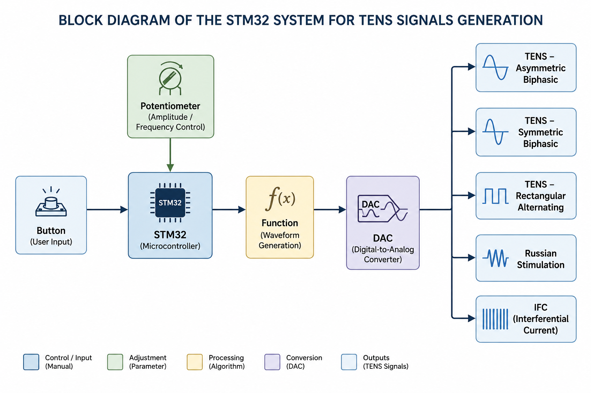
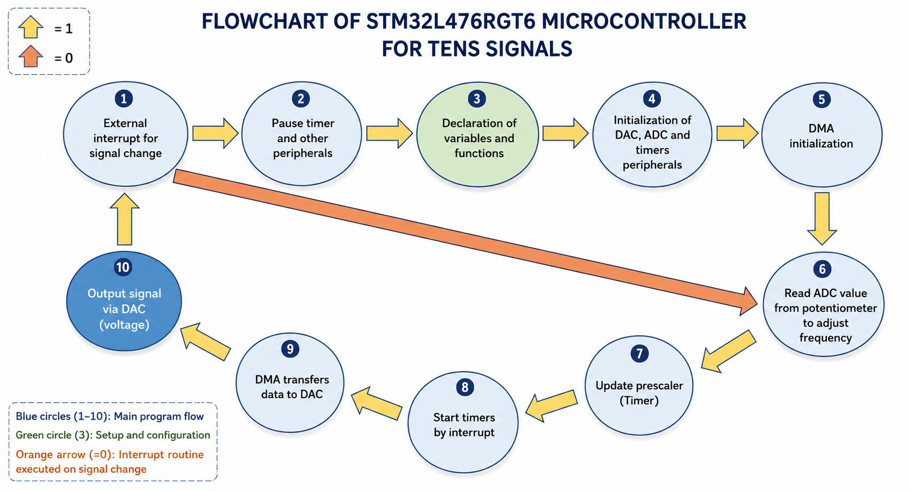
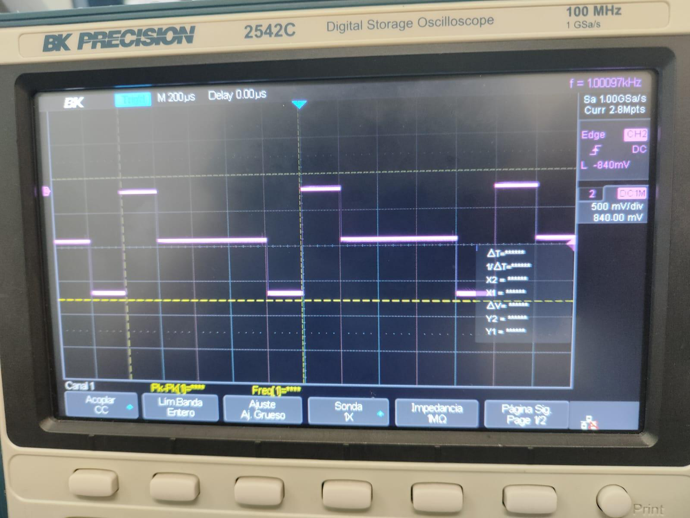
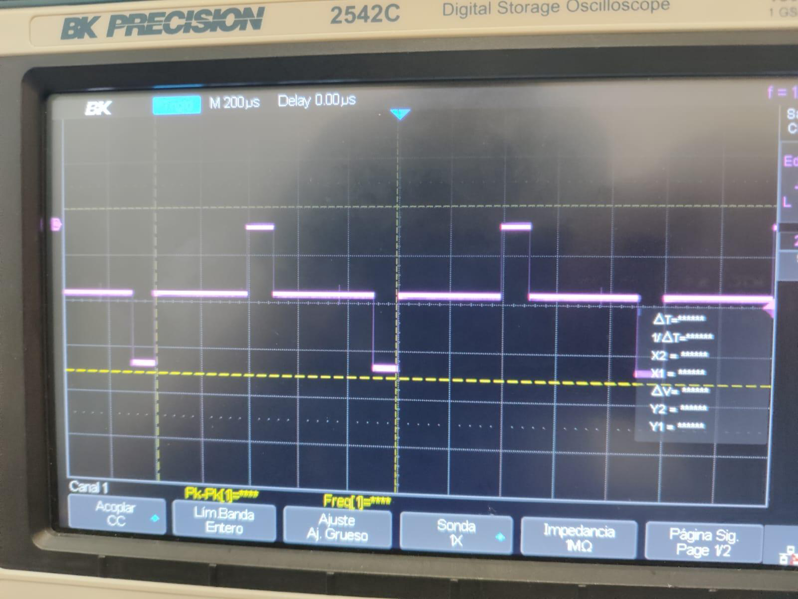
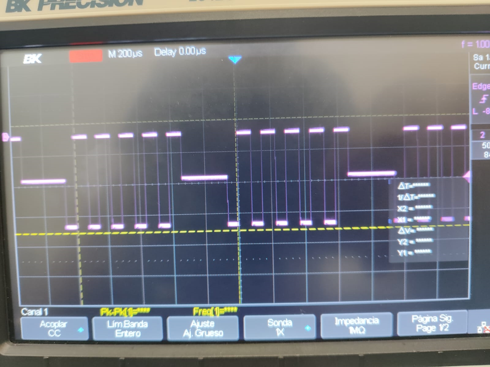
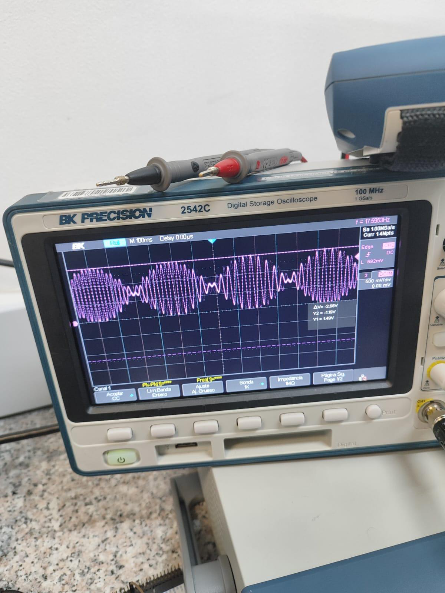
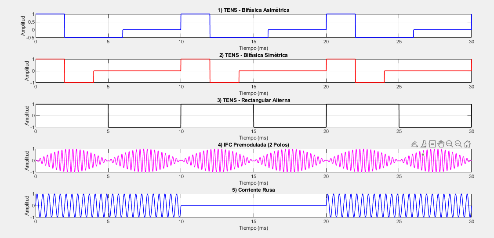

# STM32-Based Therapeutic TENS Signal Generator

> Embedded firmware for generating therapeutic TENS waveforms using an STM32L476RGT6 microcontroller.



---

## Project Highlights

- Embedded firmware developed on STM32L476RGT6
- Real-time therapeutic waveform generation
- Five TENS stimulation profiles
- DAC-based analog signal synthesis
- Adjustable frequency (100 Hz–1 kHz)
- MATLAB waveform modeling and validation
- ADC, DMA and Timer integration
- Biomedical engineering application

---

## Overview

This project implements an embedded firmware application capable of generating multiple therapeutic electrical stimulation (TENS) waveforms using the integrated DAC of an STM32L476RGT6 microcontroller.

The main objective was to explore the application of embedded systems in biomedical engineering by implementing several stimulation profiles commonly used in Transcutaneous Electrical Nerve Stimulation (TENS) therapy. Before deployment on the microcontroller, each waveform was mathematically modeled and validated in MATLAB to verify its behavior and facilitate its implementation.

The firmware performs real-time waveform generation while allowing users to select different stimulation profiles and adjust the output frequency directly from the embedded hardware.

---

## Biomedical Context

Transcutaneous Electrical Nerve Stimulation (TENS) is widely used in rehabilitation and pain management by applying controlled electrical pulses to stimulate nerves and muscles.

This project focuses on the embedded generation of these therapeutic waveforms for educational and research purposes, demonstrating how a modern microcontroller can accurately synthesize multiple stimulation profiles through its integrated peripherals.

---

## Key Features

- Five therapeutic waveform implementations
- Real-time DAC signal generation
- Push-button waveform selection
- Potentiometer-controlled frequency adjustment
- MATLAB-assisted waveform design
- Lookup-table waveform synthesis
- Timer-synchronized signal generation
- DMA-assisted DAC transfer
- Embedded firmware developed with STM32CubeIDE

---

## Hardware Platform

The project was implemented on an **STM32L476RGT6** using its integrated peripherals:

- 12-bit DAC
- 12-bit ADC
- DMA Controller
- Hardware Timers
- GPIO Interrupts
- Push Button
- Potentiometer

The combination of these peripherals enables stable and deterministic analog waveform generation with minimal processor overhead.

---

## Firmware Architecture

The firmware follows a modular architecture in which each peripheral performs a dedicated task:

| Peripheral | Function                   |
|------------|----------------------------|
| DAC        | Analog waveform generation |
| ADC        | Frequency adjustment       |
| DMA        | Waveform transfer          |
| Timers     | Signal synchronization     |
| GPIO       | Waveform selection         |
| Interrupts | User interaction           |

This architecture allows continuous waveform generation while maintaining accurate timing throughout the system.

---

## Signal Generation Strategy

The development of every waveform follows the same engineering workflow:

1. Mathematical modeling
2. MATLAB simulation and validation
3. Waveform discretization
4. Lookup table generation
5. STM32 firmware implementation
6. Real-time DAC synthesis

This methodology ensures that the generated analog waveform closely matches its theoretical model before being deployed on the embedded platform.

---

## Supported Therapeutic Waveforms

The firmware currently implements the following stimulation profiles:

- Biphasic Symmetric
- Biphasic Asymmetric
- Alternating Rectangular
- Russian Current
- IFC Premodulated

Each waveform was adapted to the STM32 DAC resolution while preserving its expected therapeutic characteristics.

---

## MATLAB Modeling and Simulation

MATLAB was used to model, simulate and validate several therapeutic waveforms before implementing them on the STM32.

The simulations were used to:

- Validate mathematical models
- Visualize waveform behavior
- Generate lookup tables
- Compare theoretical and embedded implementations

The complete MATLAB Live Script is available in:

📄 **Documentation/health_tech_signals.mlx**

The complete laboratory report containing the mathematical derivations and implementation details is also included:

📄 **Documentation/Laboratorio 3 Señales Tens.pdf**

---

## Signal Generation Pipeline

```text
MATLAB Modeling
      │
      ▼
Waveform Validation
      │
      ▼
Lookup Table Generation
      │
      ▼
STM32 Firmware
 ├── ADC
 ├── DMA
 ├── Timers
 ├── DAC
 └── GPIO
      │
      ▼
Analog TENS Waveform
```

---

## System Architecture


---

## Firmware Flowchart



---## Results

The figures below summarize both the mathematical modeling and the embedded implementation of the therapeutic waveforms.

### Firmware Architecture


---

### MATLAB Signal Modeling

| Biphasic Symmetric | Biphasic Asymmetric |
|:------------------:|:-------------------:|
|  |  |

| Russian Current | IFC Premodulated |
|:---------------:|:----------------:|
|  |  |

---

### MATLAB Simulation



The therapeutic waveforms were mathematically modeled and validated in MATLAB before being implemented on the STM32 microcontroller. This verification step ensured that each waveform matched its theoretical behavior prior to embedded deployment.

---

## Repository Structure

```text
.
├── Code/
│   ├── Core/
│   ├── Drivers/
│   ├── Debug/
│   ├── .settings/
│   ├── Health_electroestimulador_tens.ioc
│   └── STM32L476RGTX_FLASH.ld
│
├── Documentation/
│   ├── health_tech_signals.mlx
│   └── Laboratorio 3 Señales Tens.pdf
│
├── Images/
│   ├── block_diagram_tens.png
│   ├── State_Machine_Diagram.png
│   ├── MATLAB_Signal_Simulation.png
│   ├── Signal_Byphasic_Symmetric.png
│   ├── Alternating_Rectangular_TENS.png
│   ├── Rusian_signal.png
│   └── IFC_signal.png
│
└── README.md
```

---

## Documentation

Additional project documentation is available in the **Documentation** directory.

| Resource | Description |
|----------|-------------|
| 📄 **health_tech_signals.mlx** | MATLAB Live Script containing waveform modeling, simulations, and signal analysis. |
| 📄 **Laboratorio 3 Señales Tens.pdf** | Technical report describing the biomedical background, mathematical development, firmware implementation, and experimental validation. |

These documents provide additional insight into the engineering methodology followed during the project.

---

## Skills Demonstrated

This project allowed me to strengthen practical experience in:

- Embedded Firmware Development
- STM32 Microcontrollers
- Digital Signal Processing
- Biomedical Engineering Applications
- MATLAB Modeling and Simulation
- DAC-Based Analog Signal Generation
- ADC Acquisition
- DMA Configuration
- Hardware Timers
- Interrupt-Driven Programming
- Real-Time Embedded Systems

---

## Future Improvements

Possible extensions for future versions include:

- LCD user interface
- Rotary encoder navigation
- Digital amplitude control
- Additional stimulation profiles
- Patient profile presets
- Data logging through UART or USB
- Bluetooth Low Energy (BLE) connectivity
- Portable battery-powered hardware
- Closed-loop stimulation control

---

## Technologies Used

| Category | Technologies |
|----------|--------------|
| Programming | C |
| IDE | STM32CubeIDE |
| Microcontroller | STM32L476RGT6 |
| Simulation | MATLAB |
| Firmware | HAL Drivers |
| Peripherals | DAC, ADC, DMA, GPIO, Timers |

---

## Author

**Roberto Sánchez*

Electronic Engineer


Feel free to explore the project, review the source code, or use the MATLAB simulations as a reference for waveform analysis and embedded signal generation.

---